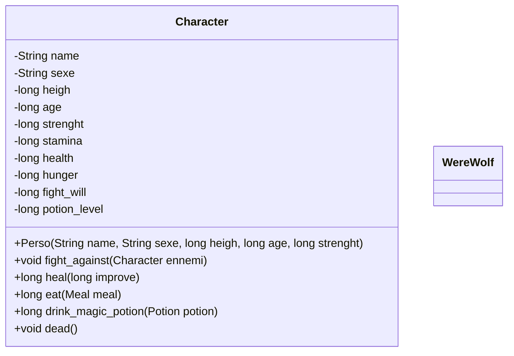

# Diagram de Class :

```mermaid
classDiagram
    class Character {
        -String name
        -String sexe
        -long heigh
        -long age
        -long strenght
        -long stamina
        -long health
        -long hunger
        -long fight_will
        -long potion_level

        +Perso(String name, String sexe, long heigh, long age, long strenght)
        +void fight_against(Character ennemi)
        +long heal(long improve)
        +long eat(Meal meal)
        +long drink_magic_potion(Potion potion)
        +void dead()
    }

    class WereWolf {
    }
```
