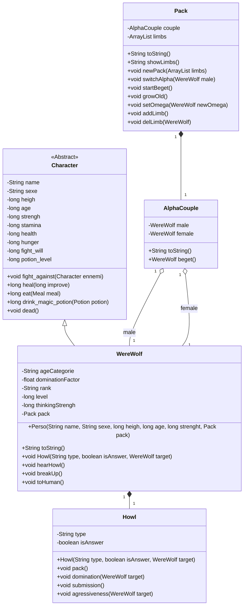

# Diagram de Class :

```mermaid
 classDiagram
    class Character {
        <<Abstract>>
        
        -String name
        -String sexe
        -long heigh
        -long age
        -long strengh
        -long stamina
        -long health
        -long hunger
        -long fight_will
        -long potion_level

        +void fight_against(Character ennemi)
        +long heal(long improve)
        +long eat(Meal meal)
        +long drink_magic_potion(Potion potion)
        +void dead()
    }

    class WereWolf {
        -String ageCategorie
        -float dominationFactor
        -String rank
        -long level
        -long thinkingStrengh
        -Pack pack

        +Perso(String name, String sexe, long heigh, long age, long strenght, Pack pack)
        +String toString()
        +void Howl(String type, boolean isAnswer, WereWolf target)
        +void hearHowl()
        +void breakUp()
        +void toHuman()
    }
    Character <|-- WereWolf


    class AlphaCouple {
        -WereWolf male
        -WereWolf female

        +String toString()
        +WereWolf beget()
    }
    AlphaCouple "1" o-- "1" WereWolf : male
    AlphaCouple "1" o-- "1" WereWolf : female

    class Pack {
        -AlphaCouple couple 
        -ArrayList<WereWolf> limbs
        
        +String toString()
        +String showLimbs()
        +void newPack(ArrayList<WereWolf> limbs)
        +void switchAlpha(WereWolf male)
        +void startBeget()
        +void growOld()
        +void setOmega(WereWolf newOmega)
        +void addLimb()
        +void delLimb(WereWolf)
    }
    Pack "1" *-- "1" AlphaCouple

    class Howl {
        -String type
        -boolean isAnswer

        +Howl(String type, boolean isAnswer, WereWolf target)
        +void pack()
        +void domination(WereWolf target)
        +void submission()
        +void agressiveness(WereWolf target)
    }
    WereWolf "1" *-- "1" Howl
```
