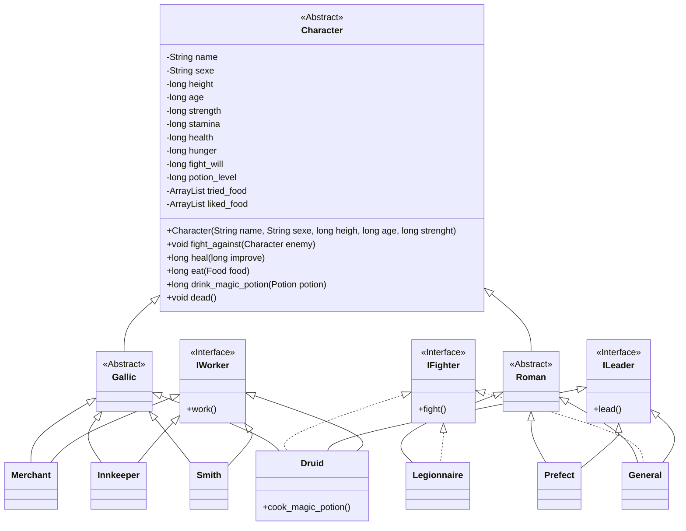

```mermaid
    
classDiagram
    
    Character <|-- Gallic
    Gallic <|-- Merchant
    Gallic <|-- Innkeeper
    Gallic <|-- Smith
    Gallic <|-- Druid

    Druid: +cook_magic_potion()

    Character <|-- Roman
    Roman <|-- Legionnaire
    Roman <|-- Prefect
    Roman <|-- General

    IFighter <|.. Legionnaire
    IFighter <|.. General
    IFighter <|.. Druid

    ILeader <|-- Prefect
    ILeader <|-- General
    ILeader <|-- Druid

    IWorker <|-- Merchant
    IWorker <|-- Innkeeper
    IWorker <|-- Smith
    IWorker <|-- Druid

    class Character {
        <<Abstract>>
        -String name
        -String sexe
        -long height
        -long age
        -long strength
        -long stamina
        -long health
        -long hunger
        -long fight_will
        -long potion_level
        -ArrayList<Food> tried_food
        -ArrayList<Food> liked_food

        +Character(String name, String sexe, long heigh, long age, long strenght)
        +void fight_against(Character enemy)
        +long heal(long improve)
        +long eat(Food food)
        +long drink_magic_potion(Potion potion)
        +void dead()
    }

    class Gallic {
        <<Abstract>>
    }

    class Roman {
        <<Abstract>>
    }

    class IFighter {
        <<Interface>>
        +fight()
    }

    class ILeader {
        <<Interface>>
        +lead()
    }

    class IWorker {
        <<Interface>>
        +work()
    }

```

    
