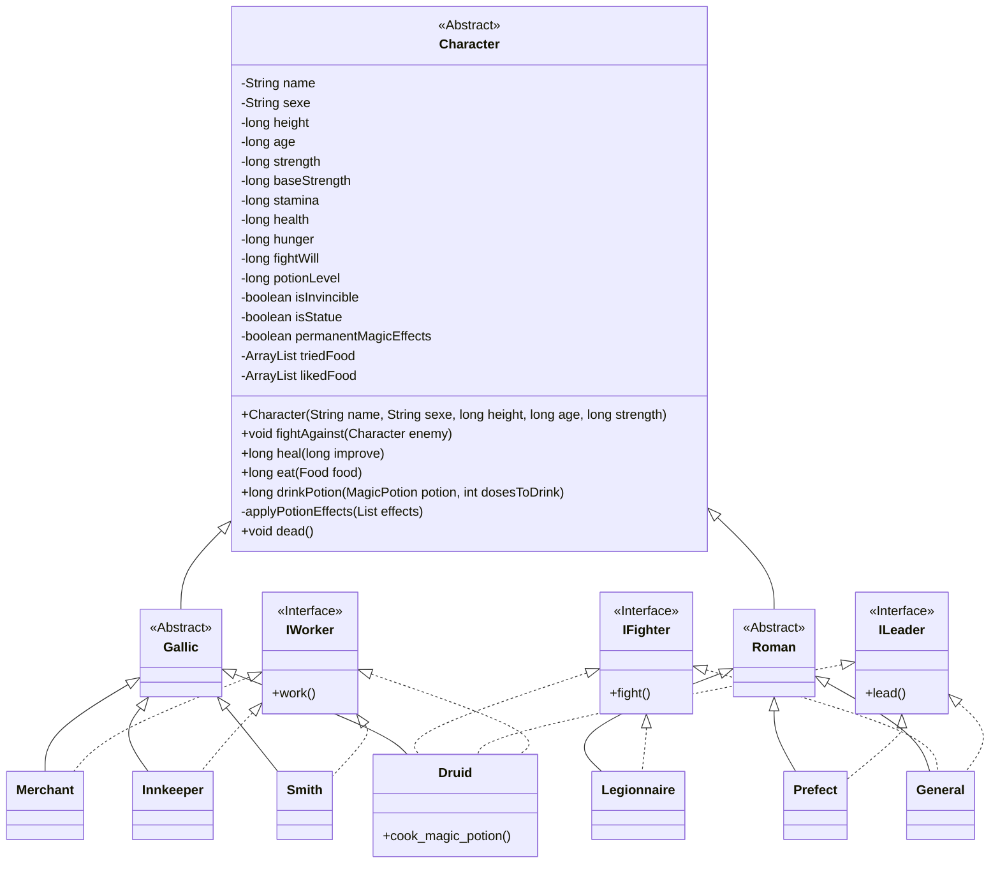

```mermaid
    
classDiagram
    
    Character <|-- Gallic
    Gallic <|-- Merchant
    Gallic <|-- Innkeeper
    Gallic <|-- Smith
    Gallic <|-- Druid

    Druid: +cook_magic_potion()

    Character <|-- Roman
    Roman <|-- Legionnaire
    Roman <|-- Prefect
    Roman <|-- General

    IFighter <|.. Legionnaire
    IFighter <|.. General
    IFighter <|.. Druid

    ILeader <|.. Prefect
    ILeader <|.. General
    ILeader <|.. Druid

    IWorker <|.. Merchant
    IWorker <|.. Innkeeper
    IWorker <|.. Smith
    IWorker <|.. Druid

    class Character {
        <<Abstract>>
        -String name
        -String sexe
        -long height
        -long age
        -long strength
        -long baseStrength
        -long stamina
        -long health
        -long hunger
        -long fightWill
        -long potionLevel
        -boolean isInvincible
        -boolean isStatue
        -boolean permanentMagicEffects
        -ArrayList<Food> triedFood
        -ArrayList<Food> likedFood

        +Character(String name, String sexe, long height, long age, long strength)
        +void fightAgainst(Character enemy)
        +long heal(long improve)
        +long eat(Food food)
        +long drinkPotion(MagicPotion potion, int dosesToDrink)
        -applyPotionEffects(List<PotionEffect> effects)
        +void dead()
    }

    class Gallic {
        <<Abstract>>
    }

    class Roman {
        <<Abstract>>
    }

    class IFighter {
        <<Interface>>
        +fight()
    }

    class ILeader {
        <<Interface>>
        +lead()
    }

    class IWorker {
        <<Interface>>
        +work()
    }

```

    
