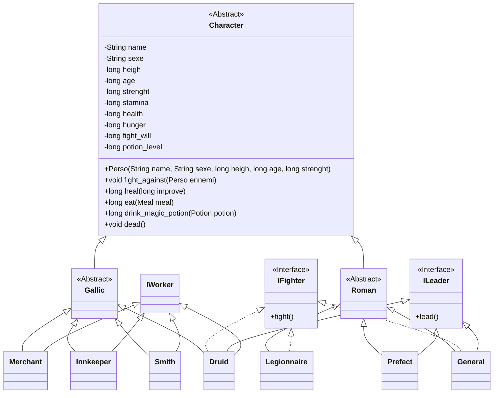

```mermaid
    classDiagram
        
        Character <|-- Gallic
        Gallic <|-- Merchant
        Gallic <|-- Innkeeper
        Gallic <|-- Smith
        Gallic <|-- Druid
    
        Character <|-- Roman
        Roman <|-- Legionnaire
        Roman <|-- Prefect
        Roman <|-- General
    
        IFighter <|.. Legionnaire
        IFighter <|.. General
        IFighter <|.. Druid
    
        ILeader <|-- Prefect
        ILeader <|-- General
        ILeader <|-- Druid
    
        IWorker <|-- Merchant
        IWorker <|-- Innkeeper
        IWorker <|-- Smith
        IWorker <|-- Druid
        
    
        class Character {
            <<Abstract>>
            -String name
            -String sexe
            -long heigh
            -long age
            -long strenght
            -long stamina
            -long health
            -long hunger
            -long fight_will
            -long potion_level
    
            +Perso(String name, String sexe, long heigh, long age, long strenght)
            +void fight_against(Perso ennemi)
            +long heal(long improve)
            +long eat(Meal meal)
            +long drink_magic_potion(Potion potion)
            +void dead()
        }
    
        class Gallic {
            <<Abstract>>
        }
    
        class Roman {
            <<Abstract>>
        }
    
        class IFighter {
            <<Interface>>
            +fight()
        }
    
        class ILeader {
            <<Interface>>
            +lead()
        }
```

    class IWorker {
        +work()
    }
