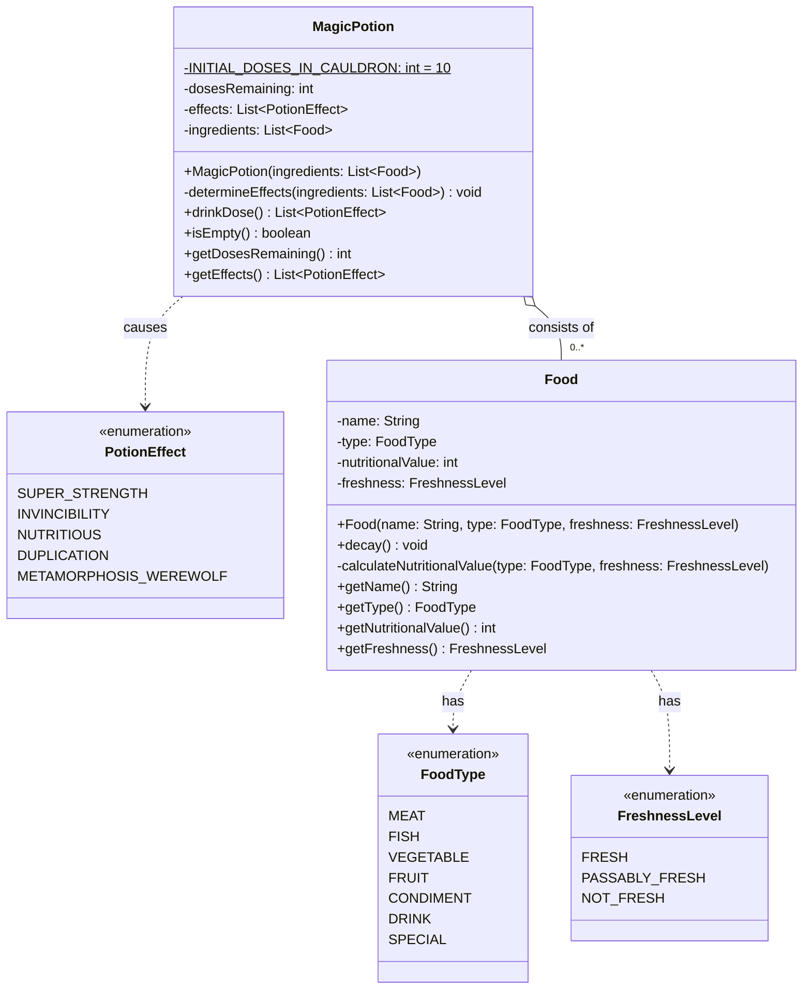

```mermaid
classDiagram
    %% --- ENUMS ---
    class FoodType {
    <<enumeration>>
    MEAT
    FISH
    VEGETABLE
    FRUIT
    CONDIMENT
    DRINK
    SPECIAL
    }

    class FreshnessLevel {
        <<enumeration>>
        FRESH
        PASSABLY_FRESH
        NOT_FRESH
    }

    class PotionEffect {
        <<enumeration>>
        SUPER_STRENGTH
        INVINCIBILITY
        NUTRITIOUS
        DUPLICATION
        METAMORPHOSIS_WEREWOLF
    }

    %% --- CLASSES PRINCIPALES ---

    class Food {
        -name: String
        -type: FoodType
        -nutritionalValue: int
        -freshness: FreshnessLevel
        +Food(name: String, type: FoodType, freshness: FreshnessLevel)
        +decay() void
        -calculateNutritionalValue(type: FoodType, freshness: FreshnessLevel)
        +getName() String
        +getType() FoodType
        +getNutritionalValue() int
        +getFreshness() FreshnessLevel
    }

    class MagicPotion {
        -INITIAL_DOSES_IN_CAULDRON: int = 10$
        -dosesRemaining: int
        -effects: List~PotionEffect~
        -ingredients: List~Food~
        +MagicPotion(ingredients: List~Food~)
        -determineEffects(ingredients: List~Food~) void
        +drinkDose() List~PotionEffect~
        +isEmpty() boolean
        +getDosesRemaining() int
        +getEffects() List~PotionEffect~
    }

    %% --- RELATIONS ---

    MagicPotion o-- "0..*" Food : consists of
    Food ..> FoodType : has
    Food ..> FreshnessLevel : has
    MagicPotion ..> PotionEffect : causes
```